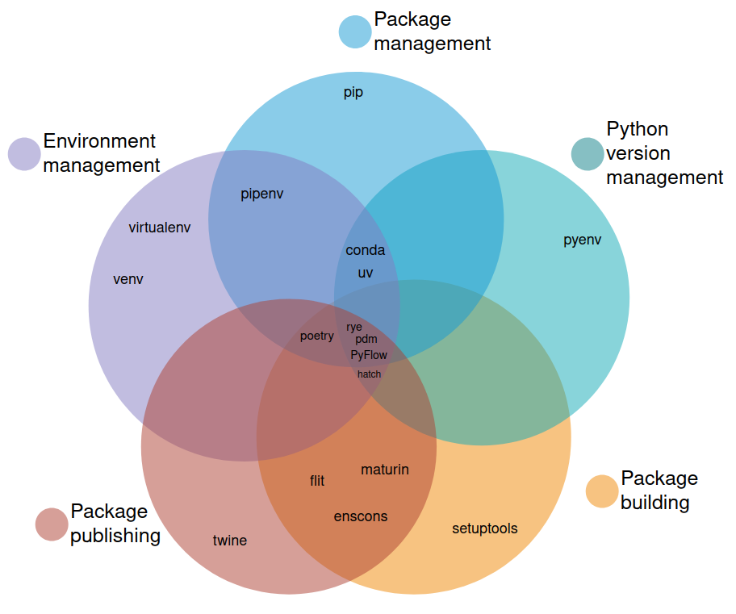
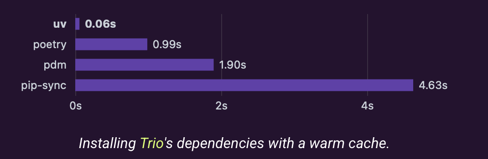

[← Previous: Typehinting](typehinting.md) | [Next: Open Closed →](open_closed.md)

# Table of Contents

- [Python Project Structure Guide](#Python-Project-Structure-Guide)
- [1. Basic Project Structure](#1.-Basic-Project-Structure)
  - [1.1 Key Components](#1.1-Key-Components)
    - [`__init__.py`](#%60__init__.py%60)
    - [pyproject.toml](#pyproject.toml)
- [2. Inside your scripts](#2.-Inside-your-scripts)
  - [2.1 the `__name__ == "__main__"` idom](#2.1-the-%60__name__-==-%22__main__%22%60-idom)
  - [2.2 Importing Between Files](#2.2-Importing-Between-Files)
    - [Best Practice Imports](#Best-Practice-Imports)
    - [Common Issues and Solutions](#Common-Issues-and-Solutions)
- [3. running your code](#3.-running-your-code)
  - [3.1 running as a script](#3.1-running-as-a-script)
  - [3.2 Multiple Scripts](#3.2-Multiple-Scripts)
  - [3.3 Direct Python execution](#3.3-Direct-Python-execution)
  - [3.4 Module Mode execution (-m flag)](<#3.4-Module-Mode-execution-(-m-flag)>)
- [4. Environment Setup](#4.-Environment-Setup)
  - [4.1 install a venv](#4.1-install-a-venv)
  - [4.2 Project Examples](#4.2-Project-Examples)
    - [simple script](#simple-script)
    - [Basic Package](#Basic-Package)
    - [Full Application](#Full-Application)
- [5. Building your project](#5.-Building-your-project)
  - [5.1 the pyproject.toml build-system](#5.1-the-pyproject.toml-build-system)
  - [5.2 installing your project](#5.2-installing-your-project)
  - [5.3 bulding your project](#5.3-bulding-your-project)
    - [What is a .whl (Wheel) File?](<#What-is-a-.whl-(Wheel)-File?>)
    - [gotchas with building](#gotchas-with-building)
  - [5.4 publishing your project](#5.4-publishing-your-project)

# Python Project Structure Guide

Beginners like jupyter notebooks because of the interactivity and short feedback loops.
However, they have a lot of downsides, too:

- it's often not clear which notebooks to run in which order
- you dont typically want to tell your client to run notebooks
- notebooks are harder to interact with in automated way
- notebooks add a lot of additional bloat to your system (eg installing jupyter adds over a 100 dependencies)
- notebooks are really unpleasant to use together with git; every single time you just run them, stuff changes (like the count of how often a cell has been executed)
- scripts are much more flexible in reusing methods / classes (eg if you define a class in a notebook, it is kind of unuseable for other notebooks / scripts)
- notebooks make your scripts even slower (and python was already among the slowest of all programming languages...)

Jupyter notebooks are a nice solution for a teaching context, but they should be left
behind in a production context. So, at some point, you need to grow up beyond just
notebooks and learn how to create a python module.

# 1. Basic Project Structure

A typical Python project structure looks like this:

```
myproject/            # Project root
|- .venv/             # Virtual environment directory
|- src/               # Source code directory
|  |- mymodule/       # Your actual module
|  |  |- __init__.py  # Makes the directory a Python package
|  |  |- main.py      # Main application code
|  |  |- utils.py     # Additional modules
|- README.md          # Project documentation
|- pyproject.toml     # Project dependencies
```

There are a lot of tools to manage this. A short overview is this image:


You can find more background in the [blog](https://alpopkes.com/posts/python/packaging_tools/) where I found this image.
What stands out, is how much different tools there are. In my eyes, this is kind of a sad state of the python ecosystem.
Most modern languages include tooling to

- manage environments and dependencies
- manage versions of your language
- publish and build packages

The fact that python has many different systems, is really not helpful; you will find a lot people that
have been using `pip` all of their life and just don't like this fancy new package you are talking about,
because "pip just works". This means that working together in a python project often means that you need to discuss the tooling first.
However, sane people are convinced when I explain that `uv` is 10-100x faster than their beloved
`pip`.



In my opinion, `uv` is the absolute winner:

- previous, `rye` and `uv` where separate projects. However, `uv` and `rye` have merged their projects. This means that `uv` does everything `rye` did.
- the quality of the project is really high
- there is just one tool; you dont need both pyenv to manage your python version, pdm to manage dependencies and setuptools to build your package. `uv` is you one-stop shop.
- If you are the kind of person that picks the longest line in the supermarket, suit yourself, but I have better things to do than waiting for my tools the fix the dependency tree. If you dont consider a 10-100x speedup as a relevant variable in picking your toolbox, I doubt your rational decision making capabilities...

## 1.1 Key Components

### `__init__.py`

This file makes a directory a Python package. It can be empty or explicitly declare public APIs:

```python
# src/mymodule/__init__.py
from mymodule.main import some_function

# Explicitly declare public API
__version__ = "0.1.0" # now people can run mymodule.__version__ to check the version
```

### pyproject.toml

Modern Python projects use pyproject.toml [PEP 631](https://peps.python.org/pep-0631/) for project metadata and build configuration:

```toml
[project]
name = "mymodule"
version = "0.1.0"
description = "My Python module"
requires-python = ">=3.11"
dependencies = [
    "requests>=3.38.0",
]

[build-system]
requires = ["hatchling"]
build-backend = "hatchling.build"

[tool.hatch.build.targets.wheel]
packages = ["src/mymodule"]

[project.scripts]
mymodule = "mymodule.main:main"
```

# 2. Inside your scripts

## 2.1 the `__name__ == "__main__"` idom

This is a piece of code that you can add to your scripts:

```python
# src/mymodule/main.py
def main():
    print("Hello World")

if __name__ == '__main__':
    main()
```

When Python runs a file, it sets special variables. One of them is __name__:

- When you run the file directly (see section 3): __name__ = '__main__'
- When you import the file: __name__ = the module's name

Having a section like `if __name__ == "__main___"` gives you control over what parts of the code to run, when.
You might want to test parts of the code by running a script directly. But you dont want to run
all these functions when you import from the file. This snippet gives you the option what to
run when calling the script directly.

## 2.2 Importing Between Files

### Best Practice Imports

```python
# Absolute import (preferred over relative)
from src.mymodule.utils import helper_function

# Relative import (from same directory)
from .utils import helper_function

# Import specific functions (always preferred over 'import *')
from src.mymodule.constants import (
    DEFAULT_TIMEOUT,
    MAX_RETRIES,
)
```

### Common Issues and Solutions

Beginning users often encounter import errors:

```bash
Error: ModuleNotFoundError: No module named 'src'
```

Common causes:

- Running from wrong directory
- Missing __init__.py files
- Module not installed or not in Python path
- venv not activated

Solutions:

```bash
cd /path/to/myproject # Always run from project root
source .venv/bin/activate # make sure your .venv is activated
python -m src.mymodule.main # only if you havent built the package; see section `building your project`
```

# 3. running your code

## 3.1 running as a script

When you add this to your `pyproject.toml`:

```toml
[project.scripts]
mymodule = "mymodule.main:main"
```

After you build your project, this will create a command-line script that you can run from anywhere. Let's break down how it works:

```
mymodule        = "mymodule.main:main"
^                 ^        ^     ^
|                 |        |     |
Command name      Module   File  Function
```

- Left side (mymodule): The command name you'll type in your terminal
- Right side ("mymodule.main:main"): Where to find the code to run
- Before the colon: Python import path to the file
- After the colon: Function name to call

To use it, first, install your package:

- using pip: `pip install -e .`
- using uv: `uv sync`

this will add your module to your .venv.
Now you can run your code by just typing in the terminal:
`mymodule`. See also 'building your project'

## 3.2 Multiple Scripts

You can define multiple entry points:

```toml
[project.scripts]
mymodule = "mymodule.main:main"
mymodule-init = "mymodule.commands:initialize"
mymodule-cleanup = "mymodule.commands:cleanup"
```

## 3.3 Direct Python execution

Run this command from your terminal, from the root of your project.

```bash
# From project root
python src/mymodule/main.py
```

> 🗒️ **NOTE:** DON'T do this - will cause import issues
>
> ```bash
> cd src/mymodule
> python main.py  # This breaks imports!
> ```

## 3.4 Module Mode execution (-m flag)

The -m flag treats the path as a module path, not a file path.

```bash
# From project root
python -m src.mymodule.main
```

# 4. Environment Setup

## 4.1 install a venv

Creating a venv with vanilla Python:

```bash
# From project root
python -m venv .venv

# Activate it
# Windows
.venv\Scripts\activate
# Unix/MacOS
source .venv/bin/activate
```

I will use this if I want to minimize dependencies and adding uv isnt strictly necessary.
And example would be, inside a Docker container.
However, sometimes I do use uv inside a container, because I really want the speedup that uv gives me; it's about [10-100x faster then pip](https://docs.astral.sh/uv/)...

Instead of using base python, we can use uv:

```bash
uv init myproject # creates folder structure plus pyproject.toml file
cd myproject
uv add numpy # adds numpy as a dependency and creates the .venv
```

If you already have a `pyproject.toml` file, or want to recreate your .venv, use `uv sync`

## 4.2 Project Examples

### simple script

```
project/
|- src/
|  |- script.py
|- .venv/
|- pyproject.toml
```

This works, but is often a bad idea; your module is now named `src`, which is not very informative.
So, it is often preferred to use the basic package setup:

### Basic Package

```
project/
|- src/
|  |- mypackage/
|  |  |- __init__.py
|  |  |- main.py
|- .venv/
|- README.md
|- pyproject.toml
```

By adding an additional directory, everyone will still know where to find your code (in the
src folder) but your module will also get a descriptive name, and if you install it you can
do `import mypackage` instead of `import src`.

### Full Application

```
project/
|- src/
|  |- myapp/
|  |  |- __init__.py
|  |  |- main.py
|  |  |- utils/
|  |  |  |- __init__.py
|  |  |  |- filehandler.py
|  |  |  |- preprocessing.py
|- tests/
|  |- test_main.py
|- .venv/
|- README.md
|- pyproject.toml
```

This mainly adds additional directories for tests and utils. The tests directory is used to
automatically run tests using a test runner like pytest. The utils directory is used to
organize your code into smaller submmodules, and you can import it like this:
`from src.mymodule.utils import helper_function` or, if you have installed your module in your env,
`from mymodule.utils import helper_function`.

# 5. Building your project

## 5.1 the pyproject.toml build-system

This part of the toml file:

```toml
[build-system]
requires = ["hatchling"]
build-backend = "hatchling.build"
```

defines your backend. `uv` uses `hatch` by default; other options are setuptools and pdm.

[Hatch](https://github.com/pypa/hatch) is not part of base Python - it's a modern build tool that:

1. Has better dependency resolution than setuptools
1. Includes environment management
1. Has simpler configuration
1. Includes development tools (formatting, testing, etc.)
1. Has better reproducible builds

You can find more documentation on the [website](https://hatch.pypa.io/latest/) of the project.
The build-system part of the code works together with

```toml
[project]
name = "mymodule"

[tool.hatch.build.targets.wheel]
packages = ["src/mymodule"]
```

## 5.2 installing your project

when building a module. You can do this with native but slow `pip` like this:
`pip install -e .`
or, when you use the faster `uv`, with `uv sync`.

This command will install your module into your active .venv and after this is succesful you should be able to:

- go into your `.venv/lib/python/site-packages` and check to see `mymodule` installed
- you can activate your `.venv`, start python (by typing `python` in your terminal) and, because the mymodule is there,
  and assuming you have a function `hi()` in your `main.py` file, do:

```python
>>> from mymodule.main import hi
>>> hi()
hello!
```

Note how you can remove the src from your import.

## 5.3 bulding your project

Using `pip install` or `uv sync` puts your code in your python environment, just like other packages you `pip install` or `uv add`.
This makes your own code importable. However, you can go one step further and actually build a package.
The easiest way to do this is, is with uv.

```bash
uv build # build a wheel and a zip of your code
uv build --wheel # builds just the wheel
```

which will result in this:

```
dist/
|- myproject-0.1.0-py3-none-any.whl   # Wheel file
```

### What is a .whl (Wheel) File?

- A wheel is a pre-built package format
- Contains your code, ready to install
- Like a zip file with a special structure
- Faster to install than source code
- Platform-specific if it contains compiled code

The advantages are that you or your colleague can now do this:

```bash
# Save wheels for offline use
cp dist/myproject-0.1.0-py3-none-any.whl ~/my-wheels/

# Install later
pip install ~/my-wheels/myproject-0.1.0-py3-none-any.whl

# Or from a network location
pip install /mnt/shared/wheels/myproject-0.1.0-py3-none-any.whl
```

### gotchas with building

setting your `name` is actually relevant:

```
src/
|- coolproject/  # Directory name
|- pyproject.toml  # name = "myproject"
```

and installing this project will result in

```python
import myproject  # Error! Python looks for myproject/ but finds coolproject/
```

## 5.4 publishing your project

One-time Setup

- Create account on PyPI (https://pypi.org)
- Get API token from PyPI

Now you can first `build` and then publish your wheel with:

```bash
uv publish --token $YOUR_TOKEN 
```

Note that this makes your code available to everyone with an internet connection!

[← Previous: Typehinting](typehinting.md) | [Next: Open Closed →](open_closed.md)
